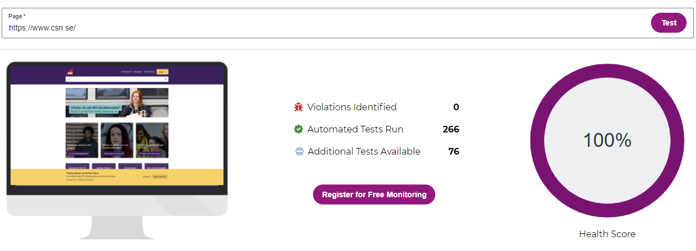
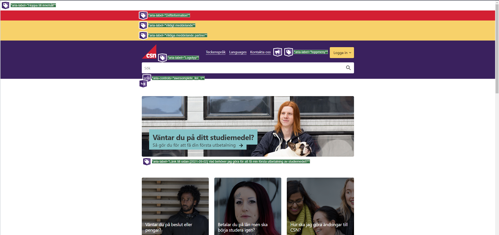
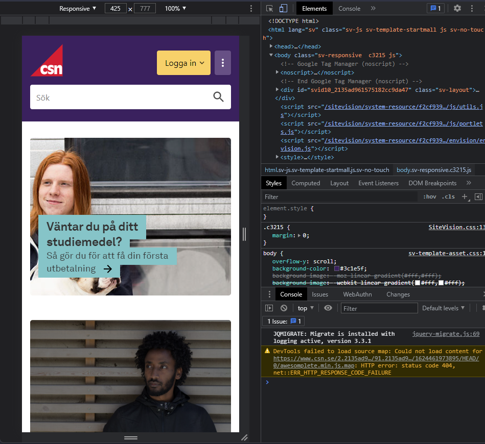
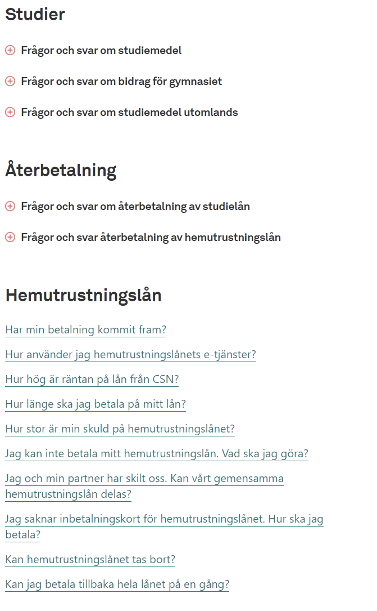

# Analysera en webbplats

Jag har valt att analysera [CSN.se][1]. Webbplatsen tillhör Centrala studiestödsnämnden vilket är en svensk myndighet.

- Vilket syfte verkar webbplatsen ha? Hur kommer du fram till det?

Webbplatsens syfte är att på ett effektivt sätt ge personer i Sverige möjligheten att söka studie-bidrag, studie-lån, hemutrustningslån och körkortslån. På CSNs webbsida står det följande,

"CSN hanterar det svenska studiestödet samt hemutrustningslån och körkortslån. Vi är också statistikansvarig myndighet för studiestödet"[2].

- Vilken målgrupp verkar webbplatsen ha? Motivera!
Hur logisk tycker du att navigeringen på webbplatsen är?

Webbplatsen verkar för det mesta rikta sig mot studenter. Det är det första som kommer upp på första-sidan, exempelvis "Så ansöker du om studielån" eller "Betalar du på lån men ska börja studera igen?". Alla bilder på hemsidan är också på yngre människor.

- Hur logisk tycker du att navigeringen på webbplatsen är?

Personligen tycker jag att navigeringen på hemsidan är mycket logisk. Det första man ser när man kommer in på hemsidan är sökrutan. Genom sökrutan kan du komma till alla underliggande sidor, inklusive alla informativa artiklar som hemsidan ger dig tillgång till. I samband med sökandet så har de även förslag på sidor, beroende på vad du skriver. De har även valt att använda sig av "bread crumbs" för att förebygga att man tappar bort sig i samband med navigerandet.

- Hur och varför används bilder på webbplatsen?

Webbplatsen använder sig av förvånandsvärt få bilder. De bilder som används däremot verkar finnas där i ett syfte att locka användarens uppmärksamhet.

- Hur är tillgängligheten, hur skulle t.ex. en synskadad uppfatta webbplatsen?

Mycket bra. Jag använde Chrome DevTools för att kolla igenom en stor del HTML-taggarna och det har använd alla nödvändiga ARIA attributer. ARIA eller Accessible Rich Internet Applications är ett sätt för att göra webbsidor mer tillgängliga för synskadade.

WebAccessibility

WebAim

Jag använde mig även utav <https://www.webaccessibility.com/> samt <http://wave.webaim.org> för att testa hemsidan.

- Är webbplatsen responsiv, alltså fungerar webbplatsen på olika skärmupplösningar/skärmstorlekar?

Här valde jag att använda mig a Chrome DevTools återigen. Hemsidan är responsiv, den anpassar sig efter alla DevTools förinställda skärmupplösningar. Här är ett exempel på hur det ser ut.

- Vilka brister i webbplatsen hittar du och vilka lösningar på problemen skulle du föreslå? - Brister kan vara både utifrån ett användarperspektiv och utifrån ett grafiskt designperspektiv.

Den största bristen ur ett användarperspektiv som jag ser är hur csn.se väljer att hantera olika språk. I språkinställningarna så finns det minst två dussin språk vilket är superbra. Problemet är det faktum att de inte översätter hela hemsidan utan väljer att istället översätta en sida med bunt artiklar istället.

Ur ett grafiskt designperspektiv så finns det bara en mycket liten brist jag ser. Det är att under Frågor och Svar sidan så separerar de inte frågorna tillräckligt bra. I en av spalterna gör dem det utmärkt med pluss-ikoner som gör det tydligt för ögat.

Jag förstår varför dem har valt att göra som de gjorde, de som är otydligt utplacerade är länkar samtidigt som de andra är "flikar". Jag hade fortfarande valt att lösa det med möjligtvis genom att ha alternerande bakgrund för varje fråga.

[1]: https://CSN.se
[2]: https://www.csn.se/om-csn/vart-uppdrag/var-verksamhet-och-uppdrag.html#:~:text=CSN%20hanterar%20det%20svenska%20studiest%C3%B6det,ocks%C3%A5%20statistikansvarig%20myndighet%20f%C3%B6r%20studiest%C3%B6det.
